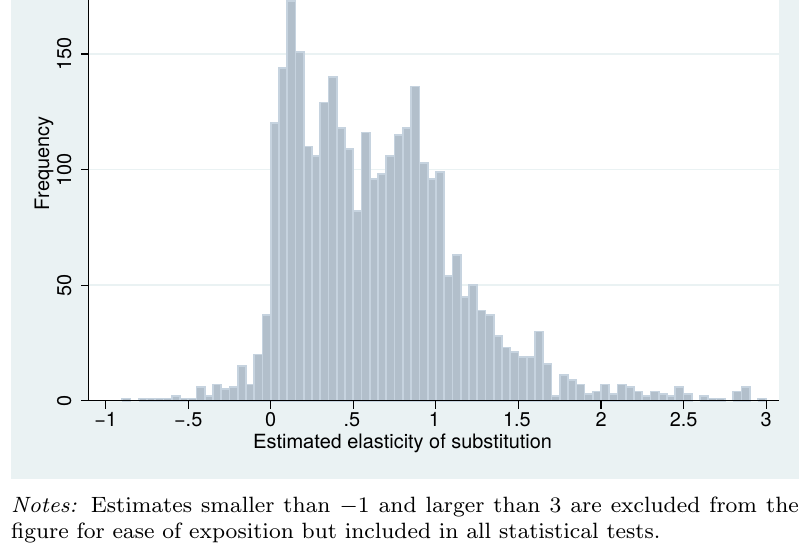

<style type="text/css">
slides > slide:not(.nobackground):after {
  content: '';
}
</style>

```{r setup, include=FALSE}
options(width = 100)
library(knitr)
opts_chunk$set(echo = TRUE)
knit_hooks$set(small.mar = function(before, options, envir) {
    if (before) par(mar = c(4, 4, .1, .1), las = 1)  # smaller margin on top and right
})
hook_output <- knit_hooks$get("output")
knit_hooks$set(output = function(x, options) {
  lines <- options$output.lines
  if (is.null(lines)) {
    return(hook_output(x, options))  # pass to default hook
  }
  x <- unlist(strsplit(x, "\n"))
  more <- "..."
  if (length(lines)==1) {        # first n lines
    if (length(x) > lines) {
      # truncate the output, but add ....
      x <- c(head(x, lines), more)
    }
  } else {
    x <- c(more, x[lines], more)
  }
  # paste these lines together
  x <- paste(c(x, ""), collapse = "\n")
  hook_output(x, options)
})
options(rcpp.cache.dir = getwd())
options(scipen = 5)
library(rstan)
library(ggplot2)
options(mc.cores = parallel::detectCores())
```

## Obligatory Disclosure

* Ben is an employee of Columbia University, which has received several research grants to develop Stan
* Ben is also a manager of GG Statistics LLC, which uses Stan for business
* According to Columbia University 
  [policy](https://research.columbia.edu/content/conflict-interest-and-research), any such employee who 
  has any equity stake in, a title (such as officer or director) with, or is expected to earn at least 
  $\$5,000.00$ per year from a private company is required to disclose these facts in presentations

<div style="float: left; width: 60%;">
<video width="500" height="250" controls>
  <source src="https://video.twimg.com/ext_tw_video/999106109523742720/pu/vid/640x360/ljdUoEqXji0ES_CV.mp4?tag=3" type="video/mp4">
Your browser does not support the video tag.
</video> 
</div>
<div style="float: right; width: 40%;">
```{r, echo = FALSE, message = FALSE, fig.height=3, fig.width=4.5, warning = FALSE}
pp2 <- cranlogs::cran_downloads(package = "rstan", from = "2015-01-01", to = Sys.Date())
library(ggplot2)
ggplot(pp2,aes(x = date, y = count)) +
  geom_smooth(show.legend = FALSE, se = FALSE) + scale_y_log10() + 
  geom_hline(yintercept = 0) + 
  geom_vline(xintercept = as.numeric(as.Date("2018-05-20")), color = "red") +
  labs(x = 'Date', y = 'Daily downloads',
    title = 'RStan Daily Downloads from RStudio Mirror',
    caption = "Season 3, Episode 9 of Billions") +
  theme(plot.caption = element_text(color = "red", face = "italic"))
```
</div>

## Main Points

- The majority of Stan users, the vast majority of potential Stan users,
  and nearly all Stan beginners should not be using Probability 
  Density Functions
  
> - Prior beliefs about unknowns are better articulated through quantile functions

> - Just a handful of very flexible quantile functions can replace
  a multitude of well-known probability distributions that lack
  explicit quantile functions

## Bayes Rule Gets Unintuitive

- If $X$ and $Y$ are defined on discrete sample spaces, Bayes' Rule is intuitive:
$$\Pr\left(y \mid x\right) = \frac{\Pr\left(y\right) \times \Pr\left(x \mid y\right)}
{\Pr\left(x\right)} = \frac{\Pr\left(y\right) \times \Pr\left(x \mid y\right)}
{\sum_{y \in \Omega_Y} \Pr\left(y\right) \Pr\left(x \mid y\right)}$$

> - If $X$ and $\theta$ are defined on continuous sample / parameter spaces, Bayes' Rule
  is less intuitive because it involves many Probability Density Functions (PDFs)
$$f\left(\theta \mid x\right) = \frac{f\left(\theta\right) \times f\left(x \mid \theta\right)}
{f\left(x\right)} = \frac{f\left(\theta\right) \times f\left(x \mid \theta\right)}
{\int_\Theta f\left(\theta\right) \times f\left(x \mid \theta\right) d\theta}$$

> - But Bayes' Rule can be re-written under a change-of-variables from $\theta$ to $p$
$$f\left(p \mid x\right) = \left|\frac{\partial}{\partial p}\theta\left(p\right) \right|
\frac{f\left(\theta\left(p\right)\right) \times f\left(x \mid \theta\left(p\right)\right)}
{f\left(x\right)} = \frac{f\left(p\right) f\left(x \mid \theta\left(p\right)\right)}{f\left(x\right)}$$

## RNGs Are More Intuitive than PDFs

- Generative modeling is more fundamental to Bayesianism than Bayes' Rule is

- Prior predictive matching is fairly intuitive even on
  continuous parameter spaces since it operates at the RNG level
  (where $\thicksim$ reads as "is drawn from"):
$$\widetilde{\theta} \thicksim \mathcal{Beta}\left(a, b\right);
  \widetilde{x} \thicksim \mathcal{Binomial}\left(n, \widetilde{\theta}\right)$$
  and then keep $\widetilde{\theta}$ iff $\widetilde{x} = x$. Acceptance
  proportion converges to $\Pr\left(x\right)$ and each kept 
  $\widetilde{\theta} \thicksim$ Beta$\left(\theta \mid a + x, b + n - x\right)$ 
  (i.e. the posterior distribution)

> - But in the Stan language, $\thicksim$ does NOT read as "is drawn from"

## Common Probability Distributions Are Not Useful

- There are too many probability distributions, leading to a paradox of choice

- None were originally intended to be used as priors

- Most common probability distributions were derived well before computers
  were invented to have elementary expressions for $\mu$ and $\sigma^2$

> - People do not have prior expectations in their heads

> - Historically, prior distribution families were chosen to do Gibbs sampling. 

> - Why has no one asked (until recently) "What probability distributions are most useful 
    for expressing beliefs about unknowns?"

## The Beta Distribution Is Particularly Not Useful

- PDF is not elementary but
  $\mu = \frac{a}{a + b}$ and
  $\sigma^2 = \frac{ab}{\left(a + b\right)^2 \left(a + b + 1\right)}$ are

- Can reparameterize as $a = \mu \left(\frac{\mu \left(1 - \mu\right)}{\sigma^2} - 1\right)$
  and $b = \left(1 - \mu\right) \left(\frac{\mu \left(1 - \mu\right)}{\sigma^2} - 1\right)$

- Beta distribution has the maximum differential entropy among all probability
  distributions over $\Theta = \left[0,1\right]$ that have a given $\mathbb{E} \ln \theta$
  and $\mathbb{E} \ln \left(1 - \theta\right)$

## Inverse Cumulative Distribution Functions (ICDFs)

- A Cumulative Distribution Function (CDF), $F\left(\theta \mid \dots\right)$, is an increasing function from 
  $\Theta$ to $\left[0,1\right]$ so its inverse is an increasing function from 
  $\left[0,1\right]$ to $\Theta$
  
- $F^{-1}\left(0.5 \mid \dots \right)$ is the median, while
  $F^{-1}\left(0.25 \mid \dots \right)$ and $F^{-1}\left(0.75 \mid \dots \right)$ are the lower and
  upper quartiles, so an ICDF is also called a quantile function

> - If $\widetilde{p} \thicksim Uniform\left(0,1\right)$ and 
  $\widetilde{\theta} = F^{-1}\left(\widetilde{p} \mid \dots\right)$, 
  then $\widetilde{\theta}$ is a realization from a probability distribution defined by that ICDF

> - $\mathbb{E}\theta = \int_0^1 F^{-1}\left(p \mid \dots\right) dp = 
\int_\Theta \theta f\left(\theta \mid \dots\right) d\theta$ iff the integrals converge

> - But CDFs and especially ICDFs rarely have explicit forms, whereas PDFs do

## Stan Skeleton with Inverse CDF Transformations

```{stan output.var="icdf", eval = FALSE}
data {
  int<lower = 0> N;                // number of observations
  vector[N] y;                     // observed outcomes
  ...                              // known hyperparameters
}
parameters {
  real<lower = 0, upper = 1> p;    // cumulative probability
}
transformed parameters {
  real theta = some_icdf(p, ...);  // parameter of interest
}
model {
  y ~ likelihood(theta);           // function of p, not y
} // no explicit prior distribution for p because implicitly uniform
generated quantities {
  real prior_y = likelihood_rng(some_icdf(uniform_rng(0, 1), ...));
  real post_y  = likelihood_rng(theta);
}
```

## Chebyshev Approximations of the 1st Kind $\left(T_k\right)$

- Suppose you wanted to approximate the ICDF of the Beta(2, 2) distribution

- Let $F^{-1}\left(p \mid a = 2, b = 2\right) = \sum_{k = 0}^\infty c_k T_k\left(2p - 1\right)$, where 
  for all $k > 1$
  $$T_k\left(2p - 1\right) \equiv 2\left(2p - 1\right) T_{k - 1}\left(2p - 1\right) - T_{k - 2}\left(2p - 1\right)$$ 
  with base cases $T_0\left(2p - 1\right) = 1$ and $T_1\left(2p - 1\right) = 2p - 1$

- $F^{-1}\left(p \mid a = 2, b = 2\right) \approx \sum_{k = 0}^K c_k T_k\left(2p - 1\right)$
  for a given finite $K$

- Chebyshev approximation converges as $K \uparrow \infty$ for any Lipschitz-continuous ICDF in a nearly minimax way
  & the minimax way is rarely analytically feasible

## Chebyshev Approximation of the Beta(2, 2) ICDF

```{r, echo = FALSE, fig.width=11, fig.height=5.5, small.mar = TRUE, fig.keep=c(2, 4, 6, 8, 10, 12, 14, 16, 17)}
source("no_name1.R")
new_slide <- function(title = paste("Approximation with", k, "interior and 2 end points")) {
  knitr::asis_output(paste0("\n\n## ", title, "\n\n"))
}
curve(qbeta(p, shape1 = 2, shape2 = 2), from = 0, to = 1, n = 10001, xname = "p", ylab = expression(theta))
legend("topleft", legend = "Beta(2,2)", lty = 1, col = 1, box.lwd = NA)

k <- 1L
new_slide()
u <- 0.5 + 0.5 * cos(pi * ((k - 1L):0 + 0.5) / k)
u <- c(0, u, 1)
q <- qno_name1(quantiles = qbeta(u, 2, 2), u, check = TRUE)
curve(q(p), from = 0, to = 1, n = 10001, xname = "p", add = TRUE, col = k + 1L, lwd = 0.5)
points(u[c(-1L, -length(u))], qbeta(u[c(-1L, -length(u))], 2, 2), pch = 20, col = k + 1L)

k <- k + 1L
new_slide()
u <- 0.5 + 0.5 * cos(pi * ((k - 1L):0 + 0.5) / k)
u <- c(0, u, 1)
q <- qno_name1(quantiles = qbeta(u, 2, 2), u, check = TRUE)
curve(q(p), from = 0, to = 1, n = 10001, xname = "p", add = TRUE, col = k + 1L, lwd = 0.5)
points(u[c(-1L, -length(u))], qbeta(u[c(-1L, -length(u))], 2, 2), pch = 20, col = k + 1L)

k <- k + 1L
new_slide()
u <- 0.5 + 0.5 * cos(pi * ((k - 1L):0 + 0.5) / k)
u <- c(0, u, 1)
q <- qno_name1(quantiles = qbeta(u, 2, 2), u, check = TRUE)
curve(q(p), from = 0, to = 1, n = 10001, xname = "p", add = TRUE, col = k + 1L, lwd = 0.5)
points(u[c(-1L, -length(u))], qbeta(u[c(-1L, -length(u))], 2, 2), pch = 20, col = k + 1L)

k <- k + 1L
new_slide()
u <- 0.5 + 0.5 * cos(pi * ((k - 1L):0 + 0.5) / k)
u <- c(0, u, 1)
q <- qno_name1(quantiles = qbeta(u, 2, 2), u, check = TRUE)
curve(q(p), from = 0, to = 1, n = 10001, xname = "p", add = TRUE, col = k + 1L, lwd = 0.5)
points(u[c(-1L, -length(u))], qbeta(u[c(-1L, -length(u))], 2, 2), pch = 20, col = k + 1L)

k <- k + 1L
new_slide()
u <- 0.5 + 0.5 * cos(pi * ((k - 1L):0 + 0.5) / k)
u <- c(0, u, 1)
q <- qno_name1(quantiles = qbeta(u, 2, 2), u, check = TRUE)
curve(q(p), from = 0, to = 1, n = 10001, xname = "p", add = TRUE, col = k + 1L, lwd = 0.5)
points(u[c(-1L, -length(u))], qbeta(u[c(-1L, -length(u))], 2, 2), pch = 20, col = k + 1L)

k <- k + 1L
new_slide()
u <- 0.5 + 0.5 * cos(pi * ((k - 1L):0 + 0.5) / k)
u <- c(0, u, 1)
q <- qno_name1(quantiles = qbeta(u, 2, 2), u, check = TRUE)
curve(q(p), from = 0, to = 1, n = 10001, xname = "p", add = TRUE, col = k + 1L, lwd = 0.5)
points(u[c(-1L, -length(u))], qbeta(u[c(-1L, -length(u))], 2, 2), pch = 20, col = k + 1L)

k <- k + 1L
new_slide()
u <- 0.5 + 0.5 * cos(pi * ((k - 1L):0 + 0.5) / k)
u <- c(0, u, 1)
q <- qno_name1(quantiles = qbeta(u, 2, 2), u, check = TRUE)
curve(q(p), from = 0, to = 1, n = 10001, xname = "p", add = TRUE, col = k + 1L, lwd = 0.5)
points(u[c(-1L, -length(u))], qbeta(u[c(-1L, -length(u))], 2, 2), pch = 20, col = k + 1L)

new_slide()
curve(qbeta(p, shape1 = 2, shape2 = 2), from = 0, to = 1, n = 10001, xname = "p", add = TRUE)
```

## The No Name Distribution of the 1st Kind

The no name distribution of the first kind has ICDF (provided it is increasing)
$$\theta\left(p; \mathbf{c}\right) \equiv \sum_{k = 0}^K c_k T_k\left(2p - 1\right)$$ 
with $\mathbf{c}$ such that $\theta\left(p; \mathbf{c}\right)$ runs through the $K + 1$ quantiles 
the user provides
  
## Tweedie($\phi = 1, \mu = 1, \xi = e$) Example {.build}

- Tweedie distribution is defined over $\Theta \in \left[0,\infty\right)$ but does not have an 
  explicit PDF, CDF, ICDF, or anything else. Nevertheless, it satisfies 
  $\mathrm{Var}\left(\theta\right) = \phi \mu^\xi$.
$$\theta\left(p; \mathbf{c}\right) \equiv e^{\tanh^{-1}\sum_{k = 0}^K c_k T_k\left(2p - 1\right)}
  \iff \tanh \log \theta\left(p; \mathbf{c}\right) \equiv \sum_{k = 0}^K c_k T_k\left(2p - 1\right)$$
```{r}
q <- qno_name1(quantiles = c(0, 1 / 3, 2 / 3, 4 / 3, Inf), u = c(0, 0.25, 0.5, 0.75, 1))
```

```{r, echo = FALSE, fig.width=11, fig.height=2.7, small.mar = TRUE, warning = FALSE}
curve(tweedie::qtweedie(p, xi = exp(1), mu = 1, phi = 1), from = 0, to = 1,
      xname = "p", ylab = expression(theta), axes = FALSE, ylim = c(0, 5))
legend("topleft", legend = c("Tweedie(1, 1, e)", "No Name"), col = 1:2, lty = 1:2, box.lwd = NA)
axis(1, at = c(0, 0.25, 0.5, 0.75, 1))
axis(2, at = round(c(0, 1 / 3, 2 / 3, 4 / 3, 7 / 3, 11 / 3, 15 / 3), digits = 3), cex.axis = 0.75)
curve(q(p), from = 0, to = 1, xname = "p", add = TRUE, col = 2, lty = 2)
u <- c(.25, .5, .75)
theta <- q(u)
for (j in 1:3) {
  segments(x0 = u[j], y0 = .Machine$double.eps, y1 = theta[j], col = 3, lty = 3)
  segments(x0 = -2, y0 = theta[j], x1 = u[j], col = 3, lty = 3)
}
```

## Standard Stable($\alpha = 1.9, \beta = 0.5$) Example {.build}

- Stable distribution is generically defined over $\Theta = \mathbb{R}$ but does not have an 
  explicit PDF, CDF, or ICDF. It does have an elementary characteristic function.
$$\theta\left(p; \mathbf{c}\right) \equiv \tanh^{-1}\sum_{k = 0}^K c_k T_k\left(2p - 1\right)
  \iff \tanh \theta\left(p; \mathbf{c}\right) \equiv \sum_{k = 0}^K c_k T_k\left(2p - 1\right)$$
```{r, error = TRUE, fig.keep='none'}
q <- qno_name1(quantiles = c(-Inf, -0.9, 0, 1, Inf), u = c(0, 0.25, 0.5, 0.75, 1))
```
```{r}
q <- qno_name1(quantiles = c(-Inf, -1.75, -0.9, 0, 1, 2, Inf), 
               u = c(0, 0.1, 0.25, 0.5, 0.75, 0.9, 1))
```

## 

```{r, echo = FALSE, fig.width=11, fig.height=6, small.mar = TRUE}
curve(stabledist::qstable(p, alpha = 1.9, beta = 0.5), 
      from = .Machine$double.eps, to = 1 - .Machine$double.eps, 
      n = 10001, xname = "p", ylab = expression(theta), ylim = c(-20, 20))
legend("topleft", legend = c("Standard Stable(1.9, 0.5)", "No Name"), col = 1:2, lty = 1:2, box.lwd = NA)
curve(q(p), from = 0, to = 1, n = 10001, xname = "p", add = TRUE, col = 2, lty = 2)
```


## Constant Elasticity of Substitution (CES) Models

$$Y_{t} \approx \gamma e^{\lambda \left(t - 1\right)} \left(\delta\left(\delta_{1}K_{t}^{-\rho_{1}} + \left(1-\delta_{1}\right)E_{t}^{-\rho_{1}}\right)^{\frac{\rho}{\rho_1}} + \left(1-\delta\right)L_{t}^{-\rho}\right)^{-\frac{\nu}{\rho}}$$

- $Y_t$ is value added, $K_t$ is capital, $E_t$ is energy, and $L_t$ is labor

- $\rho = \frac{1}{\sigma} - 1$ and $\rho_1 = \frac{1}{\sigma_1} - 1$ where $\sigma > 0$ is
  the elasticity of substitution between labor and both capital and energy (the quantity of 
  interest), while $\sigma_1 > 0$ is the elasticity of substitution between capital
  and energy
  
- $\gamma, \lambda > 0, \delta \in \left(0,1\right), \delta_1 \in \left(0,1\right)$ 
  and $\nu > 0$ are not that important today

- Take logarithms and assume Gaussian error with standard deviation $\omega > 0$.
  Informative priors on the parameters are essential to avoid divergences.

## Point Estimates of $\sigma_1$ from Gechert et al. (2019)



## Prior Quantile Function for $\sigma$ and $\sigma_1$

```{r, fig.width=11, fig.height=4.5, small.mar = TRUE, warning = FALSE, message = FALSE}
q <- qno_name1(quantiles = c(0, 0.27, 0.5, 0.9, Inf), u = c(0, 0.25, 0.5, 0.75, 1))
ggplot(data.frame(sigma = q(runif(9999)))) + geom_freqpoly(aes(x = sigma, after_stat(density))) + xlim(0, 3)
```

## Stan Program for a CES Model {.smaller}

<div class="columns-2">
```{stan CES, cache = TRUE, output.var="CES"}
// defines no_name1_icdf(p, u, theta)
#include no_name1.stan
data {
  int<lower = 0> T; // if T == 0, this draws from priors
  vector[T] log_Y;
  vector[T] log_K;
  vector[T] log_E;
  vector[T] log_L;
  positive_ordered[5] u;    ordered[5] theta[7];
  positive_ordered[6] u_lg; ordered[6] theta_lg;
}
parameters {
  vector<lower = 0, upper = 1>[8] p;
}  // cumulative probability primitives
transformed parameters {
  real sigma   = no_name1_icdf(p[1], u, theta[1]);
  real sigma_1 = no_name1_icdf(p[2], u, theta[2]);
  real delta   = no_name1_icdf(p[3], u, theta[3]);
  real delta_1 = no_name1_icdf(p[4], u, theta[4]);
  real nu      = no_name1_icdf(p[5], u, theta[5]);
  real omega   = no_name1_icdf(p[6], u, theta[6]);
  real lambda  = no_name1_icdf(p[7], u, theta[7]);
  real log_gamma = no_name1_icdf(p[8], u_lg, theta_lg);
}
model {
  real rho   = -1 + inv(sigma);
  real rho_1 = -1 + inv(sigma_1);
  real nu_rho = nu / rho;
  real log_delta = log(delta);
  real log_delta_1 = log(delta_1);
  real log1m_delta = log1m(delta);
  real log1m_delta_1 = log1m(delta_1);
  real rho_rho_1 = rho / rho_1;
  vector[T] mu;
  for (t in 1:T) // with numerical stability
    mu[t] = log_gamma
          + lambda * (t - 1)
          - nu_rho
          * log_sum_exp(log_delta + rho_rho_1
          * log_sum_exp(log_delta_1 - 
                        rho_1 * log_K[t],
                        log1m_delta_1 - 
                        rho_1 * log_E[t]),
                        log1m_delta - 
                        rho * log_L[t]);
  log_Y ~ normal(mu, omega); // log-likelihood
} // MLEs invariant to the ICDF transformations
```
</div>

## Maximum Likelihood Estimates of a CES Model

```{r}
data(GermanIndustry, package = "micEconCES")
GermanIndustry <- log(subset(GermanIndustry, year < 1973 | year > 1975)[ , 2:5])
colnames(GermanIndustry) <- paste0("log_", c('Y', 'K', 'L', 'E'))
dat <- c(list(T = nrow(GermanIndustry), u_lg = c(0, 0.25, 0.5, 0.75, 0.9, 1),
              theta_lg = c(-2, 1, 3, 5, 7, 10), u = c(0, 0.25, 0.5, 0.75, 1),
              theta = list(sigma   = c(0, 0.27, 0.5, 0.9, Inf),  
                           sigma_1 = c(0, 0.27, 0.5, 0.9, Inf),
                           delta   = c(0, 1/3, 0.5, 2/3, 1), 
                           delta_1 = c(0, 1/3, 0.5, 2/3, 1), nu = c(0, 0.6, 1.0, 1.4, Inf),
                           omega   = c(0, 0.016, 0.03, 0.05, 0.15),
                           lambda  = c(0, 0.01, 0.02, 0.03, 0.05))), GermanIndustry)
```
```{r}
MLEs <- optimizing(CES, data = dat, as_vector = FALSE, refresh = 0, seed = 54321)
round(rbind(theta = unlist(MLEs$par[-1]), p = MLEs$par$p), digits = 3) # delta on boundary
```

## Posterior Estimates for a CES Model

```{r, post, cache = TRUE, output.lines = 5:14, dependson = "CES"}
post <- sampling(CES, data = dat, seed = 12345,
                 control = list(adapt_delta = 0.96, max_treedepth = 12), refresh = 0)
print(post, pars = "p", include = FALSE, probs = c(.025, .1, .25, .5, 0.75, .9, .975))
```
```{r, echo = FALSE}
cat("Maximized likelihood is", MLEs$value)
```

## Conclusions

* Your audience is unlikely to be equipped to understand prior PDFs
* Quantiles rather than expectations are an easier entry point
* Avoid prior PDFs by utilizing the logic of RNGs that apply an ICDF to a standard uniform random variate 
  to obtain a random variate from the intended distribution
* We need to get ICDFs into Stan (many of them are in Boost)

> - Construct a prior ICDF rather than choosing one from list

## References {.smaller}

- Chalabi, Y., 2012, _New Directions in Statistical Distributions, Parametric Modeling and Portfolio Selection_,
  Dissertation, ETH Zurich. [Link](https://www.research-collection.ethz.ch/bitstream/handle/20.500.11850/64963/eth-6457-02.pdf?sequence=2&isAllowed=y)
- Gechert, S. et al., 2019 "Death to the Cobb-Douglas Production Function? A Quantitative Survey of the Capital-Labor Substitution Elasticity", ZBW – Leibniz Information Centre for Economics, Kiel, Hamburg [Link](https://www.econstor.eu/bitstream/10419/203136/1/main_SG.pdf)
- Gil, A., Segura, J., and Temme, N., 2007, _Numerical Methods for Special Functions_, 
  Society for Industrial and Applied Mathematics. [Chapter 3](https://archive.siam.org/books/ot99/OT99SampleChapter.pdf)
- Gilchrist, W., 2000, _Statistical Modelling with Quantile Functions_, CRC Press. [Link](https://www.google.com/books/edition/Statistical_Modelling_with_Quantile_Func/7c1LimP_e-AC?hl=en&gbpv=1&dq=Statistical+Modelling+with+Quantile+Functions&printsec=frontcover)
- Hadlock, C., 2017, _Quantile-Parameterized Methods for Quantifying Uncertainty in Decision Analysis_,
  Dissertation, University of Texas at Austin. [Link](https://repositories.lib.utexas.edu/bitstream/handle/2152/63037/HADLOCK-DISSERTATION-2017.pdf?sequence=1&isAllowed=y)
- Henningsen, A. and Henningsen G., 2014 "Econometric Estimation of the 'Constant Elasticity of Substitution' Function in R: Package micEconCES", [Vignette](https://cran.r-project.org/web/packages/micEconCES/vignettes/CES.pdf)
- Keelin, T. and Powley B., 2011, "Quantile Parameterized Distributions", _Decision Analysis_,
  8(3) 206 -- 2019. [Link](http://www.metalogdistributions.com/images/KeelinPowley_QuantileParameterizedDistributions_2011.pdf)
- Trefethen, L., 2013, _Approximation Theory and Approximation Practice_,
  Society for Industrial and Applied Mathematics. [Website](http://www.chebfun.org/ATAP/)
